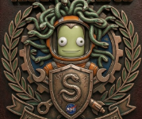
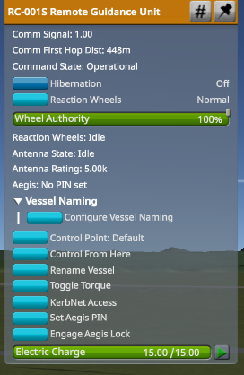
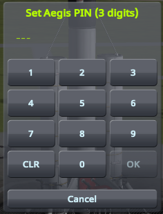
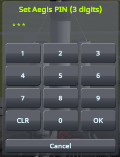
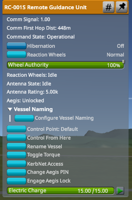
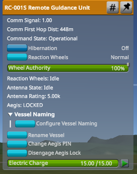
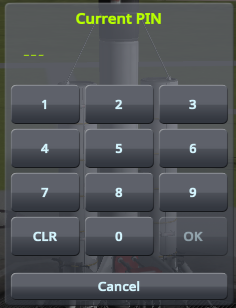
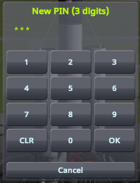

<p align="center">
  
</p>

<h1 align="center">IkosAegis</h1>

**Version 0.2.0** — KSP 1.12.x. Windows, Linux and macOS.

**Put a PIN on your ships.** IkosAegis adds a keypad lock to every command part in the game
— probe cores and crewed pods alike. Set a code in the VAB, engage the lock, and the craft
will not pitch, roll, yaw, throttle, stage, or fire an action group until somebody types the
code back in. The crew cannot climb out, and nobody can climb in.

**One craft, one lock, one PIN.** A ship with a probe core and two command pods has a single
code, set and cleared from any of them — not three separate locks to keep track of.

Useful for roleplay saves, shared saves, stream setups where chat can touch the ship, or
just for the pleasure of a craft that answers to a number only you know.

---

## Requirements

| | |
|---|---|
| **KSP** | 1.12.x (the mod stands down outside 1.12.0 – 1.12.99) |
| **ModuleManager** | **Required.** Without it no part receives the module and the mod does nothing at all |
| **Harmony** (`HarmonyKSP`) | **Required for recovery blocking only.** Without it everything else works and the log says so |
| **OS** | Any. Nothing here is platform-specific |

## Install

### With CKAN (recommended)

Search for **IkosAegis** and install. ModuleManager and Harmony come with it.

### By hand

1. Install [ModuleManager](https://github.com/sarbian/ModuleManager) and
   [Harmony](https://github.com/KSPModdingLibs/HarmonyKSP/releases) if you don't have them.
2. Unzip the release over your KSP folder — the zip's top level is `GameData`, so it merges
   straight in.

```
GameData/
  000_Harmony/
    0Harmony.dll
  ModuleManager.4.2.3.dll
  IkosAegis/
    IkosAegis.version
    LICENSE
    ReadMe.txt
    Plugins/
      IkosAegis.dll
    Patches/
      AegisLock.cfg
```

If ModuleManager is missing, the mod says so in a dialog at startup — without it, no part
receives the lock and nothing appears in any part menu. If Harmony is missing, it says so in
the log and everything except recovery blocking still works.

## Using it

### 1. Right-click any command part

Aegis adds one readout and two buttons to the part menu — `Aegis: No PIN set`,
**Set Aegis PIN**, and **Engage Aegis Lock**:



The readout has three states — **`No PIN set`**, **`Unlocked`**, **`LOCKED`** — and the two
buttons relabel themselves to match.

### 2. Set a PIN

**Set Aegis PIN** opens the keypad. The display shows one `_` per digit still expected and
one `*` per digit entered — and **OK stays greyed out until the entry is the full length**,
so a short code cannot be submitted at all rather than being accepted and then rejected:

<p>
  
  
</p>

The readout becomes `Unlocked` and the button becomes **Change Aegis PIN**:



### 3. Engage the lock

**Engage Aegis Lock**. The readout becomes `LOCKED`, and the part menu collapses:



Compare against the previous shot: **Control Point, Control From Here, Toggle Torque and
KerbNet Access are gone.** That is not a bug — the lock hides every part-menu button on the
whole craft, on every part. You cannot decouple, deploy a solar panel or fire an engine from
a part menu while locked either.

The two Aegis buttons are the deliberate exception, and they are the only way back in.

### 4. Unlock

**Disengage Aegis Lock** opens the keypad titled **Enter Aegis PIN**. Correct PIN →
`Access granted. <vessel> unlocked.` and controls return. Wrong PIN →
`Access denied: incorrect PIN.`

**Engage** is also bindable to an action group. **Disengage** is not: it needs a PIN typed
by a human, so there is nothing sensible to put on a key.

### Changing the PIN in flight

**Change Aegis PIN** on a craft that already has one asks for the current code first — two
keypads in sequence. Without that step, changing the PIN would be an unlock in four
keypresses.

<p>
  
  
</p>

Get the current PIN wrong and the second keypad never opens — you get
`Access denied: that is not the current PIN.` and the wrong-code counter goes up.

In the **VAB or SPH** there is no first step: the craft is being designed and there is
nothing to defend yet, so the code can be set freely.

### What "locked" actually blocks

| | |
|---|---|
| Pitch, roll, yaw, throttle | blocked |
| Staging, SAS, RCS | blocked |
| Wheel steering and throttle | blocked |
| Every action group | blocked |
| **Every part's right-click buttons**, on every part of the craft | blocked (except the two Aegis buttons) |
| **Crew going EVA** from the locked craft | blocked |
| **Anyone boarding** while the locked craft is nearby | blocked |
| **Anything docking** to the locked craft | blocked |
| **Terminating** the craft from the tracking station | blocked — PIN required, same as recovery |
| **Autopilots and synced multiplayer input** driving the craft | blocked |

**Not** blocked, on purpose:

- **The two Aegis buttons.** They are the way back in; see
  [Design notes](#the-part-action-window-is-the-whole-problem).
- **Time warp.** A locked craft you cannot warp past would be a worse experience than one
  you can.
- **Camera, map view, and switching to another vessel.** The lock is on the craft, not on
  the player.

### Docking

**Nothing can dock to a locked craft.** While the lock is engaged, a port on it never
reports finding anything to dock with, so the approach simply never completes.

Docking is a third door into a locked vessel: once two craft are hard-attached they are one
vessel, sharing resources, crew-transfer routes and a staging stack. Blocking controls and
hatches while leaving docking open would not be much of a lock.

Nothing is written to the port or the save: unlock the craft and docking works again
immediately. An earlier version disabled the ports themselves, which KSP saves - so a port
could be left dead permanently. If you have a craft affected by that, this version re-enables
it automatically on load and says so in the log.

### Recovery and termination

**A locked vessel cannot be recovered or terminated without the PIN.** Every route is
covered — Recover in flight, Recover and Terminate in the tracking station, and the vessel
markers around the Space Centre. Each one refuses and opens the keypad instead:

> `[Aegis] <vessel> unlocked for recovery. Press the button again within 45s.`

Entering the correct PIN **authorises the next attempt on that craft**; it does not unlock the
vessel and it does not do the deed for you. Press the button again and it goes through. The
grant expires after 45 seconds and is dropped on any scene change, so it can't be banked — and
it covers whichever of the two you press, since proving you know the code shouldn't have to be
done twice because you changed your mind between recovering and scrapping.

#### The launch-site exemption

**A craft parked on a launch pad or a runway can always be recovered or terminated, locked or
not, with no prompt.** This is the only case that is not guarded at all.

This is the one deliberate hole in the feature, and it is there so the mod can never leave a
save with a permanent obstruction in it: a craft you can't fly, can't recover and can't
remove, blocking the pad forever because the PIN went with a chat message three weeks ago.

It is **not** merely `Landed` — a locked lander sitting on the Mun is landed, and exempting
that would give the whole feature away. Any one of these counts:

- the craft is in KSP's `PRELAUNCH` state — sitting where it was rolled out, never yet flown.
  Covers rockets on the pad and spaceplanes on the runway alike;
- it is landed at a **Space Centre facility you can launch from**. That is exactly the pad
  and the runway — the game tags each with a VAB or SPH editor, which is what distinguishes
  them from the VAB, R&D or Mission Control. Landing on the lawn outside Mission Control is
  still not an exemption;
- it is landed at a **registered launch site**, which covers Making History's Woomerang and
  Dessert sites and anything a mod adds, without this mod naming any of them.

The site names are read from the game rather than hardcoded, because KSP is not consistent
about them: a craft on the pad reports its location as `LaunchPad` in one save and
`KSC_LaunchPad_Platform` in another — the facility name and the collider name for the same
slab of concrete. Every name the game knows for each launch site is checked, and the list it
found is written to `KSP.log` at startup so a miss is diagnosable rather than mysterious.

> Recovery and termination blocking needs **Harmony** (see [Requirements](#requirements)). If
> Harmony is missing, the mod says so in the log and everything else still works — but locked
> vessels can be recovered and deleted freely.

### Crew, EVA and boarding

A control lock stops a craft flying. On its own it does nothing about a Kerbal climbing out
and nothing about a fresh Kerbal climbing in — so "locked" would mean "locked, unless you
get out and walk". Both are therefore restricted while a lock is engaged:

- **EVA is refused** from a locked craft, per attempt, naming the Kerbal and the craft.
- **Boarding is refused** while a locked craft is loaded in the scene.

> **The boarding restriction is coarse.** KSP has no per-attempt hook for boarding — only a
> single game-wide switch — so while a locked craft is within physics range, boarding
> *anything* in the scene is refused, including an unrelated craft parked alongside.
>
> It is handled carefully: the switch is only ever turned off if it was on (if you have
> already disabled boarding in your difficulty settings, IkosAegis leaves it alone and never
> turns it back on), and it is restored around every save so a suppressed value cannot end up
> in your `.sfs`.

## ⚠ Remove the mod and every lock opens

**All of these protections live in the plugin. Uninstall IkosAegis and every locked craft in
the save is simply unlocked** — the controls come back, the crew can EVA, ports dock, and
the vessel recovers. Nothing is enforced by the savegame itself; `isLocked` is just a
`true` sitting in a `ConfigNode` that nothing reads any more.

That is a deliberate property, not an oversight. A mod that could permanently damage a save
it is no longer installed in would be a worse thing to ship. It does mean the lock is
**exactly as strong as the guarantee that everyone is running the mod**, which in single
player is total and in multiplayer is whatever the server enforces — see below.

Note this is *not* a secrecy problem — the PIN is readable in the save anyway, by design
([see below](#the-pin-is-not-a-secret--and-that-is-the-point)). It is an enforcement problem:
without the plugin, nothing reads `isLocked` at all.

### Multiplayer (Luna Multiplayer)

Both restrictions are safe under LMP, and the design was checked against its source rather
than assumed:

- **Boarding** uses `GameParameters.Flight.CanBoard`, which is per-client and which LMP never
  writes. Suppressing it cannot stop another player boarding *their* unlocked craft — it only
  restricts the local player, in a scene that already contains a locked vessel.
- **EVA** is refused per attempt via `GameEvents.onAttemptEva`, deliberately **not** via the
  matching `CanEVA` flag. LMP's `VesselLockSystem` sets `CanEVA = false` while spectating and
  unconditionally `true` when spectating stops, so a mod holding that flag would be silently
  overridden by LMP — and would break LMP's spectate mode in return. A per-attempt veto has
  no such conflict: any number of mods can refuse independently, and nobody holds state.

#### Terminating works the same way

**Terminate** in the tracking station is guarded exactly like Recover: same keypad, same
45-second grant, same launch-site exemption. Both are ways of taking a craft away from its
owner, so both ask the same question — and a PIN you have proved once covers whichever of the
two you then press.

#### Locked means locked against software, not just against a keyboard

A control lock stops the *player's input*. It does nothing about code that writes to the
vessel's control state — which is how autopilots work, and how Luna Multiplayer applies a
remote player's throttle and stick to a craft on your machine.

So a locked craft also has its control state zeroed every frame. Without that, another player
switching to your locked vessel could fly it: their client is applying their input to the
craft directly, and no input lock on any machine sits in that path.

#### Making the mod compulsory on your server

Because removing the mod removes the locks, **a shared server should require it**. LMP can
refuse a connection from anyone who does not have the exact same DLL, and it is worth
turning on.

Server-side, edit **`LMPModControl.xml`** in the server's `Config` folder. Two settings do
the work:

```xml
<ModControlStructure>

  <!-- Reject any plugin that is not listed below as Mandatory or Optional.
       Default is true (permissive); false is the strict mode. -->
  <AllowNonListedPlugins>false</AllowNonListedPlugins>

  <MandatoryPlugins>
    <DllFile>
      <Text>IkosAegis - PIN locks. Required, or locked craft are not locked.</Text>
      <Link>https://github.com/taz00/IkosAegis</Link>
      <FilePath>IkosAegis/Plugins/IkosAegis.dll</FilePath>
      <Sha>80-64-45-C6-39-84-...-C9-BE-F3-1B</Sha>
    </DllFile>
    <DllFile>
      <Text>Harmony 2 - required by IkosAegis for recovery blocking</Text>
      <FilePath>000_Harmony/0Harmony.dll</FilePath>
    </DllFile>
  </MandatoryPlugins>

</ModControlStructure>
```

| Field | Meaning |
|---|---|
| `AllowNonListedPlugins` | `false` rejects any DLL not in `MandatoryPlugins` or `OptionalPlugins`. This is the "everyone runs the same set" switch |
| `MandatoryPlugins` | Missing → connection refused, naming the file |
| `Sha` | **Optional but the important one.** When set, the client's DLL must hash to exactly this, so a *modified* build is refused too. Leave it empty to accept any version |
| `OptionalPlugins` | Allowed, not required |
| `ForbiddenPlugins` | Explicitly banned |
| `RequiredExpansions` | e.g. `MakingHistory`, `Serenity` |

**`FilePath` is relative to `GameData`** and is compared case-insensitively.

**The `Sha` is SHA-256 in `BitConverter` format — uppercase hex, hyphen-separated**, not the
plain hex most tools print. To generate one:

```powershell
$dll = "GameData\IkosAegis\Plugins\IkosAegis.dll"
((Get-FileHash -Algorithm SHA256 $dll).Hash -split '(..)' -ne '') -join '-'
```

The easy way to get a starting file: in game, have LMP **generate `LMPModControl.xml`** — it
writes one into your KSP folder listing every DLL you have, with hashes, under
`OptionalPlugins`. Move the entries you want to enforce into `MandatoryPlugins`, set
`AllowNonListedPlugins` to `false`, and drop it in the server's `Config` folder.

A client that fails the check is told exactly what is wrong — *"Required file … is missing!"*
or *"Required file … does not match hash …!"* — so players can fix it themselves.

> Pin the `Sha` only if you are willing to update it on every IkosAegis release: a version
> bump changes the hash and will lock out everyone who updated, or everyone who didn't.
> Listing the file without a `Sha` still guarantees *presence*, which is what makes the locks
> real.

### Setting and changing the code

- In the **VAB or SPH**, the code can be set freely — the craft is being designed and there
  is nothing to defend yet.
- In **flight**, changing an existing code requires the current one first. Otherwise
  changing the PIN would be an unlock in four keypresses.
- A part with **no PIN set refuses to lock**. A lock whose code is the empty string opens
  by pressing OK, which is not a lock.

### Wrong codes

Three wrong entries disable the keypad for 30 seconds, and every further failure doubles
that up to a five-minute cap. The timer runs on real seconds, so it cannot be warped
through. Both numbers are configurable per part — see [Configuring](#configuring).

This is a deterrent against mashing the pad, not a security control. It resets on a
quickload, which is deliberate: a player who has genuinely forgotten their own code should
not be punished for reloading.

## The PIN is not a secret — and that is the point

The PIN is stored **in plain text** in the craft file and the savegame. Anyone you share a
save with can read it, and in a Luna Multiplayer session that means every player on the
server.

That is a deliberate trade, made after trying the alternative. An earlier version encrypted
the PIN with a key belonging to your machine and user account, which did hide it — and made
the code **impossible to share**. You could not give a crewmate the PIN so they could fly
your craft, because their client had no way to check it. A code that only works on one
computer is not a PIN; it is a per-machine binding wearing a keypad.

It is worth being clear about how much privacy was actually given up, because it is less than
it sounds: **a three-digit code cannot be protected at rest by anything that must also verify
on somebody else's machine.** Even a salted hash falls to a thousand offline guesses. At this
length the secrecy was mostly notional. The shareability is real.

So treat the PIN as *a key you can hand out*, not as a secret:

- It works on any machine, for anybody you give it to. That is the feature.
- It stops the casual and the accidental — a stranger who wanders over to your station, a
  viewer with a redeem, a crewmate who does not know the code.
- It does not stop someone determined enough to open your save in a text editor. Nothing that
  works across machines could.

The startup log states this plainly on every run, so a server owner cannot be surprised by it:

```
[IkosAegis][INFO] PINs are stored in PLAIN TEXT in the craft file and savegame, so a code
can be shared with another player and used on any machine - and can also be read by anyone
you share the save with.
```

## Configuring

Everything lives in `Patches/AegisLock.cfg`. To change the defaults for every command part,
drop a file of your own into `GameData` — do not edit the shipped patch, or your changes
disappear on the next update:

```cfg
@PART[*]:HAS[@MODULE[ModuleAegisLock]]:AFTER[IkosAegis]
{
	@MODULE[ModuleAegisLock]
	{
		@pinLength = 5          // 3-8; anything outside is clamped
		@lockoutAfter = 0       // 0 turns the wrong-code penalty off entirely
		@lockoutSeconds = 60    // base penalty, doubles per failure past the threshold
	}
}
```

`:AFTER[IkosAegis]` is available because the shipped patch runs at `:FOR[IkosAegis]` rather
than `:FINAL`. `:NEEDS[IkosAegis]` works too, in any patch of your own.

### Excluding parts

Every part with a `ModuleCommand` gets a lock, including crewed pods. To exempt some,
add a patch of your own (don't edit the shipped file — your changes go on the next update):

```cfg
@PART[mk1pod_v2|Mark1Cockpit]:AFTER[IkosAegis]
{
	!MODULE[ModuleAegisLock] {}
}
```

### Docking and undocking

Two craft that dock become one vessel, so their locks must merge. The rule is the cautious
one:

- **Locked if either half was locked.** Docking is not a way to launder a locked craft into
  an unlocked one.
- **The PIN comes from the half that was locked.** If both were locked with different codes,
  one wins and the other is discarded.

Undocking gives both halves the same PIN, because the code is stored on every command part.

## Design notes

### The Part Action Window is the whole problem

`ControlTypes.ALL_SHIP_CONTROLS` (`0x0C47FFFFFFFE32BF`) contains `ACTIONS_SHIP`
(`0x800000`), and `ACTIONS_SHIP` gates **every button in every part's right-click menu**.
The unlock button is one of those buttons. So the naive version of this mod locks a craft
and hides its own way out — permanently, with no in-game recovery. The first test flight
did exactly that.

`UIPartActionWindow.CanActivateEvent` decides this. For a part on the active vessel in
flight it reduces to:

```
if (!guiActive || !active || disabledByVariant) return false;
if (ACTIONS_SHIP is locked)          return guiActiveUncommand;
if (!vessel.IsControllable)          return guiActiveUncommand;
if (!requireFullControl)             return true;
if (TWEAKABLES_FULLONLY is unlocked) return true;
return guiActiveUncommand;
```

**`guiActiveUncommand` is the escape hatch**, and the Aegis buttons set it. That turns the
problem into a feature: the mod can lock with the *full* mask — killing every other
part-menu button on the craft, which is a much stronger lock — while its own two buttons
stay reachable.

`ModuleAegisLock` checks this at load time and **refuses to lock the part** if the flag is
ever missing, rather than trusting it. A lock nobody can open is worse than no lock.

(Verified by disassembling `Assembly-CSharp` with Mono.Cecil. The IL is the only
documentation this rule has.)

### Locks are released centrally, not by the parts

`InputLockManager` is a single global stack shared with the game and every other mod, and a
leaked lock leaves the player unable to fly anything until they restart.

So the lock modules do not take locks. They own a boolean, and a single addon recomputes
every frame which locks *should* exist and makes reality match. A part destroyed by an
explosion, a vessel unloading, a revert to launch, a scene change with a keypad open — all
of them simply remove the module from the list, so its lock stops being justified and is
released on the next frame. No ending needs its own cleanup code, which is the only way to
be sure none was missed.

## Credits

| | |
|---|---|
| **Idea and concept** | [Ice King of Space](https://www.twitch.tv/icekingofspace) |
| **Developed by** | [drebsdorf](https://www.twitch.tv/drebsdorf) |

**AI was used in this project.**

### How that worked in practice

The mod was built from a concept sketch in prose, with AI assistance (Claude). The design
decisions, the API verification against the game's own assemblies, and the testing were done
in that collaboration; the concept, direction and review are the authors'.

Worth being concrete about, since "AI was used" covers a wide range. Three things in the
original sketch did not survive contact with the real API, and they are the sort of thing
that reads perfectly and does not work: the Part Action Window problem described above, a
call to a `KSPAudioSound.PlaySound` helper that does not exist in KSP 1.12, and a
`DialogGUILabel` overload that does not exist either.

The Part Action Window problem was **not** caught by reasoning about it. A first attempt
fixed the wrong bits and still shipped a craft that could be locked and never unlocked. It
was caught by flying it, and then settled by disassembling the game's own IL rather than
guessing a third time. Most of what is documented in this README was learned that way round.

## Licence

MIT — see [LICENSE](LICENSE).
